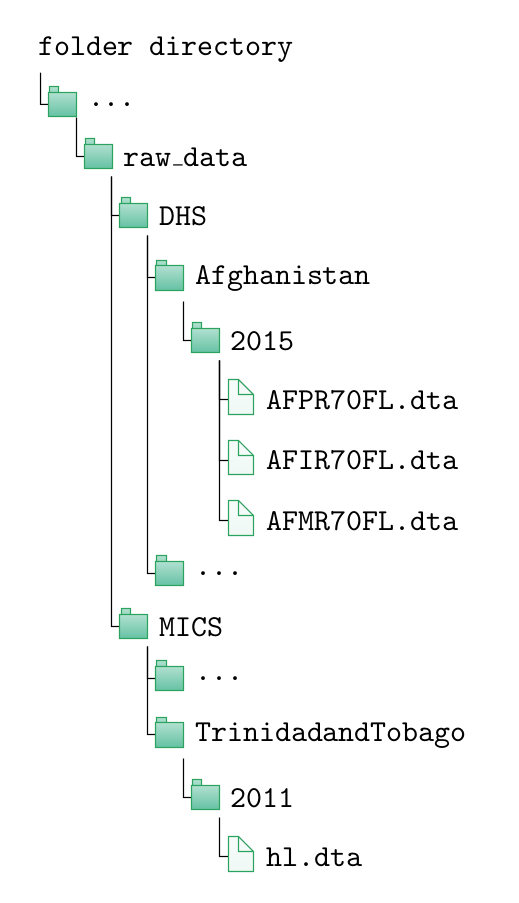

# WIDE

The goal of WIDE package is to generate the statistics WIDE tables.

## Description 

## Prerequisites 

You need to have the following commands installed: `catenate`, `fs`, `odbc`, `replacestrvar`, `renamefrom`, `sdecode`, `sxpose` and `tosql`.

For example, to install the `fs` package you must run this line of code:
 
      ssc install fs

## Installation 

The ado files should be placed in the `c:\ado\personal\` folder and read by Stata from there. They should not be placed in the `c:\ado\plus\` folder (where packages downloaded from the Internet are located) because they may be deleted in an update.

## Raw data 

The use of this package requires that the data from each source (DHS and MICS) be in a specific folder. In particular, MICS files should not have a generic name, the one that comes with the download, but should be called by the country name, the year and "hl" that identifies the corresponding base. If the name of the country consists of more than one word each must be capitalized, unless one of them is "and".

## Auxiliary data

In addition to the raw data, different auxiliary tables are used to standardize both MICS and DHS data. 

| Table   | Description |
|---------|-------------|
|country_iso_codes_names | adds the iso code3 variable |
|dictionary | selects the variables in each country dataset and standardizes the names|
|fix_duration | fixes duration stage values|
|fix_date | transforms the dates according to the Gregorian calendar|
|fix_ethnicity | standardizes the categories|
|fix_region | standardizes the categories|
|fix_religion | standardizes the categories|
|recode_edulevel | fixes education level values |
|group_eduyears | groups countries according to the calculation formula adopted for years of education|
|renamevars | renames some variables|
|setcode | recodes some variables |

The files corresponding to these auxiliary tables should be organized according to the following diagram:

## Example

This is a basic example which shows you how to use this package:

